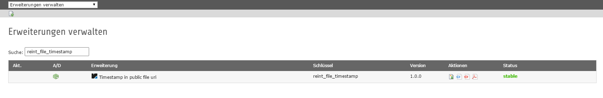

.. ==================================================
.. FOR YOUR INFORMATION
.. --------------------------------------------------
.. -*- coding: utf-8 -*- with BOM.

.. include:: ../Includes.txt

.. _admin-manual:

Administrator Manual
====================

Target group: **Administrators**

This extension needs one click: installed.
There are no dependencies to other extension, only to TYPO3 core.

.. _admin-installation:

Installation
------------

To install the extension, perform the following steps:

#. Go to the Extension Manager
#. Install the extension

   Extension Manager

   Install it in the Extension Manager

.. _admin-configuration:

Configuration
-------------

#. Nothing has to be configured, just install

.. _admin-faq:

FAQ
---

What to do if I have problems with this extension?
^^^^^^^^^^^^^^^^^^^^^^^^^^^^^^^^^^^^^^^^^^^^^^^^^^^^
Please write a bug report on `Github <https://github.com/Kephson/reint_file_timestamp/issues>`_ an report the problem 
to the owner of this extension.