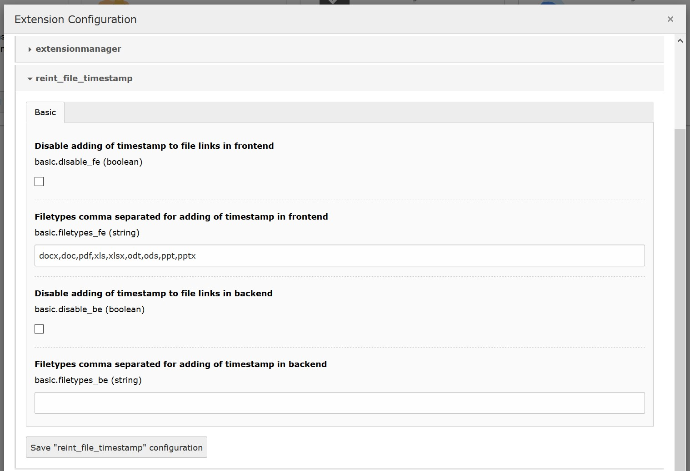

.. ==================================================
.. FOR YOUR INFORMATION
.. --------------------------------------------------
.. -*- coding: utf-8 -*- with BOM.

.. include:: ../Includes.txt

.. _admin-manual:

Administrator Manual
====================

Target group: **Administrators**

This extension should be installed via "composer require renolit/reint-file-timestamp".
There are no dependencies to other extension, only to TYPO3 core.
The package could be activated via extension manager or via TYPO3 console plugin.

.. _admin-installation:

Installation
------------

To install the extension, perform the following steps:

#. Add package on command line via "composer require renolit/reint-file-timestamp"
#. Install the extension via extension manager or use the TYPO3 console plugin to activate it

.. _admin-configuration:

Configuration
-------------

#. Configure the extension via "Admin tools->Settings->Extension configuration->reint_file_timestamp"

   Extension configuration

   Extension configuration in admin tools

.. _admin-faq:

FAQ
---

What to do if I have problems with this extension?
^^^^^^^^^^^^^^^^^^^^^^^^^^^^^^^^^^^^^^^^^^^^^^^^^^^^
Please write a bug report on `Github <https://github.com/Kephson/reint_file_timestamp/issues>`_ and report the problem
to the owner of this extension.